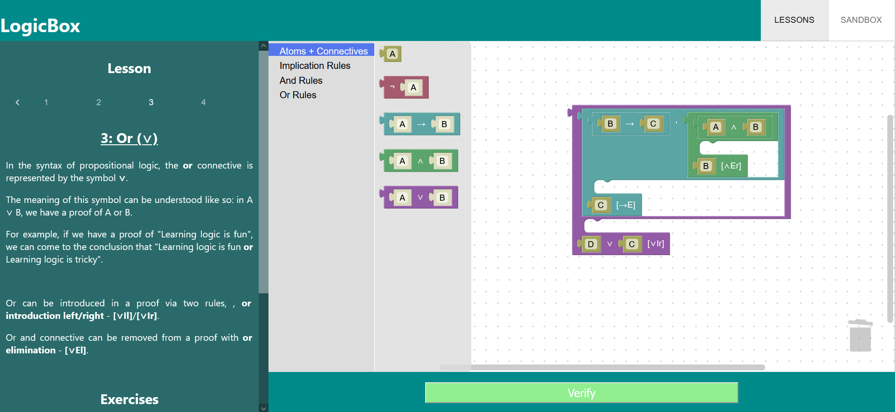
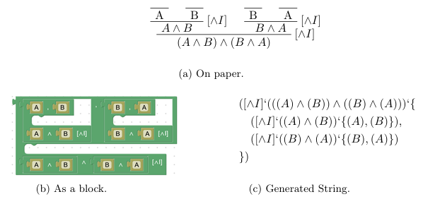

# LogicBox
### Final year project (2:1) for the University of Birmingham.

Developed with React + HTML/CSS. 
Utilizes Google's [Blockly](https://github.com/google/blockly) library and [nbudin](https://github.com/nbudin)'s [react-blockly](https://github.com/nbudin/react-blockly) library.

## Run
Install packages: `npm install` 
Run app: `npm run dev`

## Description
A resource developed to assist the learning of first year students studying Propositional Logic. 
Application utilizes a graphical interface, guided lessons and exercises. 
 

## How It Works
### Proof Strings
Behind the UI, proofs are represented as strings which follow this template: 
`([prop_logic_rule]‘conclusion_of_rule‘{list_of_proofs_of_premises})`, where: 
<ul>
  <li>prop_logic_rule: The Propositional Logic rule used to achieve the conclusion.</li>
  <li>conclusion_of_rule: The conclusion of a rule application.</li>
  <li>list_of_proofs_of_premises: The proofs of each premise used in a rule
      application, stored as a list. Each of these proofs also follows the template
      specified above.</li>
</ul> 

### Proof Parser
These strings are [parsed](https://github.com/JasonP2002/logicbox/blob/c533138ba78a30b968c7101cd4a340e9371277b0/src/utils/ProofParser.js), which returns a data structure like this: 
`[conclusion_of_rule_use,prop_logic_rule_used,children]`, where: 
<ul>
  <li>conclusion_of_rule_use: The conclusion of a rule application.</li>
  <li>prop_logic_rule_used: The rule used to achieve the conclusion.</li>
  <li>children: The proofs of each premise used in a rule application. Each of
      these proofs also follows the data type specified above.</li>
</ul>

### Proof Verifier
The [proof verifier](https://github.com/JasonP2002/logicbox/blob/c533138ba78a30b968c7101cd4a340e9371277b0/src/utils/ProofVerifier.js) recursively verifies these data structures, to ensure Propositional Logic rules are used correctly. If not, an appropriate error message is returned.
